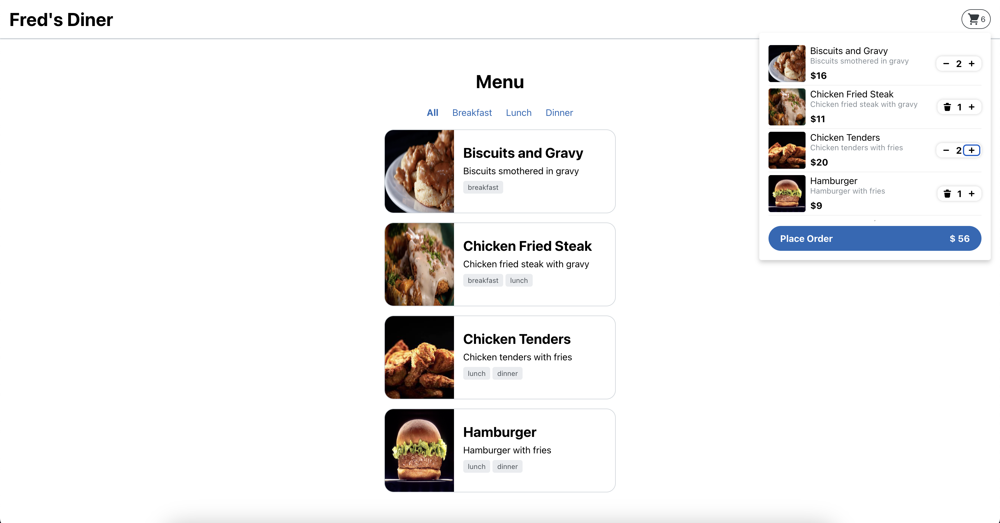

# About

This is a simple app that displays a list of menu items. You can add
menu items to the cart to submit an order.

Not everything in this repo follows best practices for React, HTML/CSS,
Accessibility, or build tooling. Highlight any of the things you feel
should be improved with the interviewer as you complete the following
tasks.

# Instructions

Start the app and get the project running.

`npm install && npm start`

Solve the following task.

## Task

Implement the cart functionality for Fred's Diner.

An image of the required design:

Requirements:

1. Follow the requested design in the image referenced above.
2. The cart should be empty by default.
3. Items are added to the cart with you click on a MenuItem
4. Once items are in the cart, each row should show an image, the quantity, and the subtotal for that item.
5. The cart should show the total of all items in the cart and the total price of the cart.
6. When the order is placed, just alert the user it is complete, and clear the cart.

Fix anything you find that you fill should be refactored.

Be ready to discuss all of your choices and how things work.

## Solution implementation

- Cart UI and functionality has been implemented

- Re-rendering of components:
  The use of CartContext caused re-renders of components where useCart hook is used.
  Details of the re-rendering:
  As intended by React, the components which have subscribed to a context will always re-render whenever there is any change in the context values.
  In our case, the we have used useCart hook, which returns the cart context values. This is why the component is re-renders whenever there is update in context values (which includes the addItem function)
  The re-render assigns the updated addItem function to the click handler, and as its a dependency for the MenuItem component, the re-render is required. Preventing the recreation of the addItem function causes the add item functionality to fail.

- (Suggestion): Absolute imports can be configured - updated tsconfig
- (Fixed): Cart flyout CSS, added visibility style
